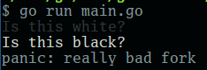

# colortest

Simple example of how to use a forked dependency with `dep`.

The forked dependency lives here: [https://github.com/sofuture/color](https://github.com/sofuture/color) and is vendored in by `dep` + `Gopkg.toml`.
